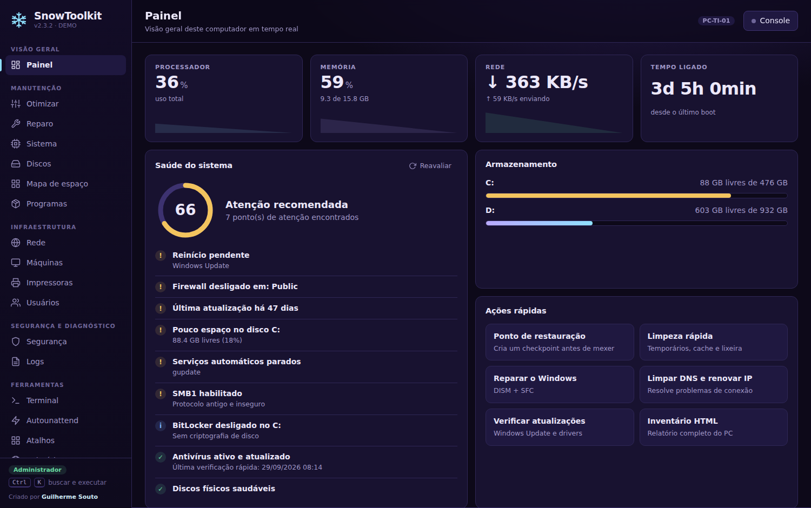
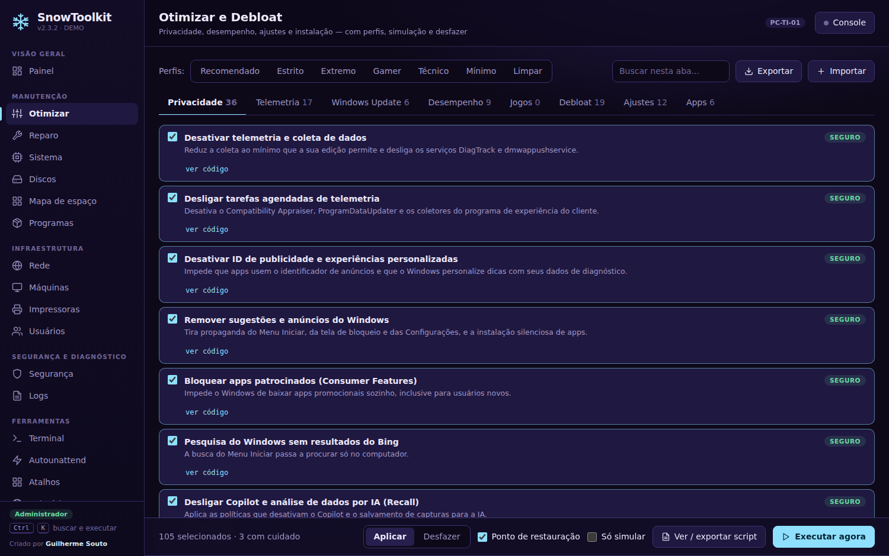

# ❄ SnowToolkit

Caixa de ferramentas de T.I. para Windows, criada por **Guilherme Souto**, num único programa com janela própria (WebView2). Feito em Go, sem dependências em tempo de execução.



## O que tem

- **Painel** com CPU, memória, disco e rede em tempo real
- **Otimizar**: presets de debloat/privacidade/desempenho, com ponto de restauração, modo Simular e desfazer por item
- **Mapa de espaço**: visualização em treemap do que ocupa o disco (estilo SpaceSniffer)
- **Apps**: catálogo instalável via winget/Chocolatey
- **Autounattend.xml**: gerador de resposta para instalação do Windows sem telas (OOBE, conta local, bypass de rede)
- **Reparo** (SFC/DISM), **Rede**, **Segurança** e mais, 18 páginas no total

| Otimizar | Mapa de espaço |
|---|---|
|  |  |

> As capturas usam o modo demo (`SnowToolkit.exe --demo`), com dados fictícios.

## Instalar

Baixe sempre a versão mais recente (a release **latest**, atualizada a cada commit):

- [`SnowToolkit-Setup.exe`](https://github.com/beemoon23/SnowToolkit/releases/latest/download/SnowToolkit-Setup.exe): instala, cria atalhos e instala o runtime WebView2 se faltar
- [`SnowToolkit.exe`](https://github.com/beemoon23/SnowToolkit/releases/latest/download/SnowToolkit.exe): versão portátil (pede administrador)

Confira os hashes em `SHA256SUMS.txt`.

### Atualização automática

Ao abrir, o programa confere no GitHub se há build novo e pergunta "Atualizar agora?". Também dá para
forçar em **Sobre → Verificar atualização**. Ele baixa o `.exe`, confere o SHA-256, troca o próprio
arquivo e reabre sozinho. Cópias compiladas fora do GitHub (sem código de build) não se atualizam.

### Como o GitHub compila e publica

A cada commit na `main`, o workflow **Build SnowToolkit** (aba **Actions**) roda `go vet` e os testes,
compila o programa e o instalador e recria a release **latest**. Não é preciso compilar no PC.

## Compilar

Go 1.22+. As dependências estão em `app/vendor`, então não precisa de internet. Veja `COMPILAR.txt`:

```
cd app
set CGO_ENABLED=0 & set GOOS=windows & set GOARCH=amd64
go build -trimpath -ldflags "-s -w -H=windowsgui" -o SnowToolkit.exe .
copy SnowToolkit.exe ..\setup\payload\
cd ..\setup
go build -trimpath -ldflags "-s -w -H=windowsgui" -o SnowToolkit-Setup.exe .
```

Para forçar o modo navegador (sem WebView2): `SNOW_BROWSER=1`.
Ícone, manifesto de administrador e versão: `python3 tools/mksyso.py app/rsrc_windows_amd64.syso`.

## Avisos

- Várias funções alteram o sistema. Use o modo **Simular** e o ponto de restauração primeiro.
- A remoção de apps na aba Otimizar não tem desfazer.
- O Autounattend por padrão não apaga o disco, mas teste sempre numa VM antes.

## Licenças

Dependências em `app/vendor` (go-webview2, go-winloader, golang.org/x/sys): MIT/BSD, licenças junto dos fontes.
